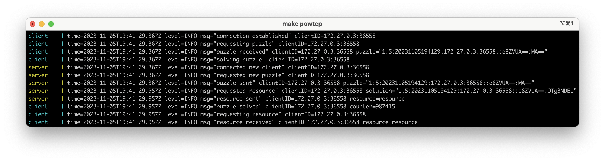

# powtcp

This project is a simple example of [Proof of work (PoW)](https://en.wikipedia.org/wiki/Proof_of_work) protected TCP server. It implements challenge-response protocol and uses [hashcash](https://en.wikipedia.org/wiki/Hashcash) algorithm.

<p align="center"> 
  
</p>

## Messaging

The server and client communicate using an internal messaging protocol. Each message ends with the `\n` character. It's used to separeate messages from each other.

A message consists of a command and a payload. They are separated by the `:` character. The payload can be any string without `\n` character. It's not very convenient in real life, but in this project all available payloads are fixed and don't contain `\n` character.

Supported commands:
* `0` - *Error*
* `1` - *RequestPuzzle*
* `2` - *ResponsePuzzle*
* `3` - *RequestResource*
* `4` - *ResponseResource*

A messaging is implemented in the [`message`](./internal/pkg/lib/message/message.go) package.

## PoW

PoW is implemented with a challenge-response protocol:

1. The client establishes a tcp connection with the server. The server starts to listening to client messages.
2. The client sends the *RequestPuzzle* command (msg: `1:\n`).
3. The server generates a new puzzle using a hashcash algorithm, stores this puzzle in the cache with some TTL and sends *ResponsePuzzle* command to the client (msg: `2:puzzle\n`).
4. The client receives a puzzle and tries to compute a puzzle hash with enough number of zero bits in the beggining. Than the client requests a resource sending a solved puzzle in the *RequestResource* command (msg: `3:solved-puzzle\n`).
5. The server receives the solved puzzle, checks TTL and sends *ResponseResource* command with some resource if that puzzle was solved correctly (msg: `4:some-resource`).
   

### Makefile

```bash
$ make help

Usage: make [command]

Commands:

 build-server          Build server app
 build-client          Build client app

 run-server            Run server app
 run-client            Run client app

 test                  Run tests
 fmt                   Format code
```